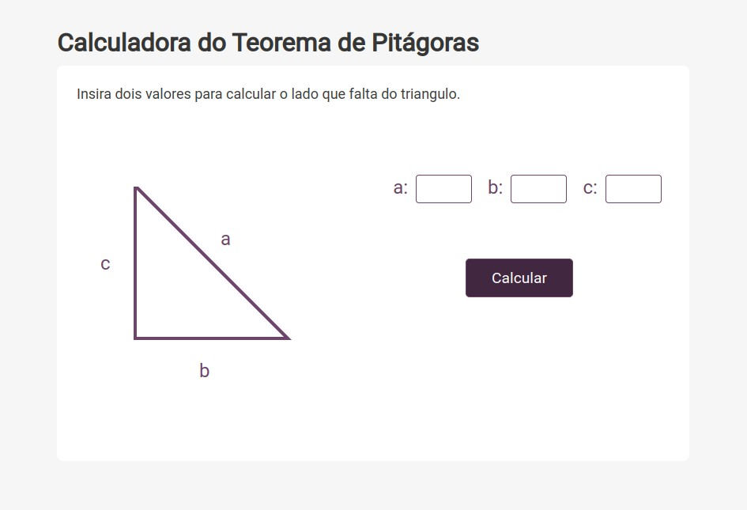

# Calculadora do Teorema de Pitágoras

  

    
    
  

    

 

## ✨ Sobre

Desafio proposto com o objetivo de calcular o Teorema de Pitágoras, desenvolvido em React e consumindo uma api feita com o framework flask.

## 📌 Acesse a api

-   [Api](https://github.com/mariaseverino/apitagoras)

## 🤔 Como Usar

-   Acesse: `https://mariaseverino-teorema-pitagoras.netlify.app/`

-   Insira valores em duas das três entradas e clique em calcular

-   Os valores serão enviados para a api e ela retornará o resultado e assim aparecerá o valor da entrada sem valor inserido ou uma mensagem de erro.
